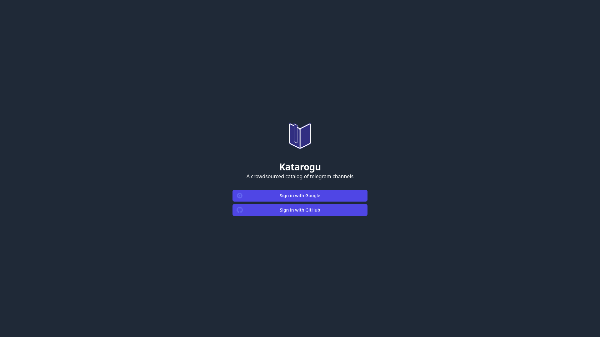
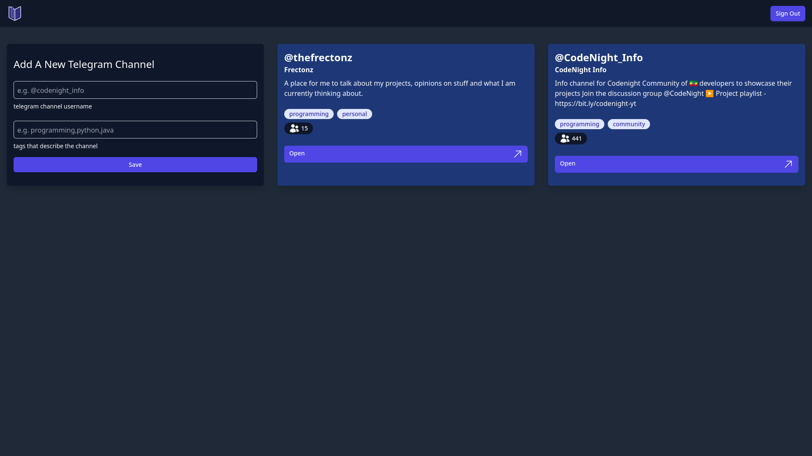

# Katarogu

A crowdsourced catalog of telegram channels. This project is an example project for [Fana Protocol](https://github.com/baydisng13/fana-doc/blob/main/README.md) a REST api for accessing data from telegram channels.

## Features

- users can see channels from the catalog
- users can add new channels to the catalog
- the channels can be tagged with categories

## Tech Stack

- [Elm](https://elm-lang.org/) programming language
- [Supabase](https://supabase.io/) for database and auth
- [TailwindCSS](https://tailwindcss.com/) for styling
- For libraries used in the project see [elm.json](./elm.json)

## Name

`Katarogu` = `Catalog` in Japanese.

## Screenshots

Signed Out

Signed In

